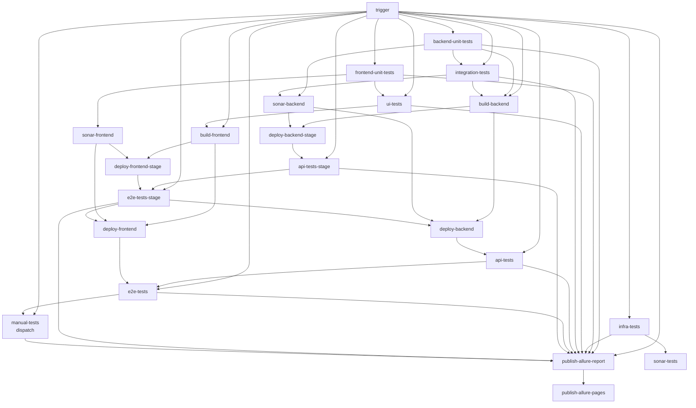

# autotests-ai-multistack-app

Teaching product — **3-folder layout**, orchestrated CI/CD. This repo is the **only** module SSOT. Ports: **[deploy/matrix.yaml](deploy/matrix.yaml)**. Contract: [`_contract/`](_contract/). Tests kit: [`tests/_tests-meta/`](tests/_tests-meta/).

GitHub: **[github.com/autotests-ai/autotests-ai-multistack-app](https://github.com/autotests-ai/autotests-ai-multistack-app)** · monorepo: `projects/autotests-ai-multistack-home/autotests-ai-multistack-app/`

Production: [autotests.ai/stack/backend-java-spring/frontend-typescript-react/](https://autotests.ai/stack/backend-java-spring/frontend-typescript-react/)

## Layout (3 product folders)

```
autotests-ai-multistack-app/
  frontend/          # UI by language → stack
  backend/           # server by language → stack
  tests/             # automation — see tests/LAYERS.md
  deploy/            # matrix, host nginx
  .github/workflows/ # ci.yml — orchestrator (job graph)
  {backend,frontend,tests}/.github/actions/  # family adapters → module actions
```

### Naming convention

`{zone}-{language}-{stack}` — hyphens between segments.  
Underscore **only** in compound tool names, e.g. `tests-java-junit5-no_allure-selenide`.

Frontend layout: language → product module (stack in the name); component tests in `src/test/`.  
Full maps: [frontend/README.md](frontend/README.md) · [tests/NAMING.md](tests/NAMING.md) · **routing SSOT:** [deploy/matrix.yaml](deploy/matrix.yaml).

| Zone | Current modules | Future slots |
|------|-----------------|--------------|
| **frontend/javascript/** | `frontend-javascript-vanilla`, `react`, `angular`, `vue`, `jquery` (all active) | — |
| **frontend/typescript/** | `frontend-typescript-vanilla`, `react` (+ RTL), `angular`, `vue` (+ VTU), `jquery` (all active) | — |
| **frontend/_shared/** | `frontend-javascript-app`, `frontend-javascript-embed`, `frontend-react-ui` | — |
| **backend/java/** | `backend-java-spring` (active) | — |
| **backend/kotlin/** | `backend-kotlin-spring` (active) | — |
| **backend/python/** | `backend-python-flask`, `backend-python-fastapi`, `backend-python-django` (active) | — |
| **backend/go/** | `backend-go-gin`, `backend-go-stdlib` (active) | — |
| **backend/javascript/** | `backend-javascript-express`, `backend-javascript-nest` (active) | — |
| **backend/typescript/** | `backend-typescript-express`, `backend-typescript-nest` (active) | — |
| **backend/csharp/** | `backend-csharp-aspnet` (active) | — |
| **backend/rust/** | `backend-rust-axum` (active) | — |
| **tests/java/** | `tests-java-junit5-rest_assured-selenide`, `selenium`, `playwright`, `restassured`, `retrofit2` (active) | junit4, testng, allure2, maven, … — [tests/NAMING.md](tests/NAMING.md) · matrix slots |
| **tests/javascript/** | `tests-javascript-api_request-playwright` (active combo), `tests-javascript-axios` | `tests-javascript-playwright` UI-only slot, Cypress, … |
| **tests/typescript/** | `tests-typescript-api_request-playwright` (active combo), `tests-typescript-axios` | `tests-typescript-playwright` UI-only slot |
| **tests/python/** | `tests-python-pytest-requests-selenium`, `requests-selene`, `api_request-playwright`, `httpx`, `requests` | UI-only `tests-python-pytest-{selenium,selene,playwright}` |
| **tests/kotlin/** | `tests-kotlin-junit5-ktor`, `selenide`, `selenium`, `playwright` | — |
| **tests/go/** | `tests-go-testing-net_http`, `playwright`; mill `tests-go-cdp` | — |
| **tests/csharp/** | `tests-csharp-nunit-restsharp-selenium`, `restsharp`, `tests-csharp-xunit-api_request-playwright` | — |
| **tests/rust/** | — | `tests-rust-testing-reqwest`, UI-only `selenium`, combo `reqwest-selenium` |

### Routing (per-frontend containers × multi-backend)

```
https://autotests.ai/stack/{backend}/{frontend}/
https://autotests.ai/stack/{backend}/api/
```

Short alias (301 redirect, same path): `https://autotests.ai/{backend}/{frontend}/` · `https://autotests.ai/{backend}/api/`

- **first path segment** → which API answers `/{backend}/api/**`
- **second path segment** → which frontend container answers (host nginx → publish port)
- Frontends resolve `APP_BASE` / `API_BASE` from the URL — same `dist/` works under every backend prefix

Examples:

- […/backend-java-spring/frontend-typescript-react/](https://autotests.ai/stack/backend-java-spring/frontend-typescript-react/)
- […/backend-java-spring/frontend-typescript-vue/](https://autotests.ai/stack/backend-java-spring/frontend-typescript-vue/)
- `…/backend-python-flask/frontend-typescript-react/`
- […/backend-python-fastapi/frontend-typescript-react/](https://autotests.ai/backend-python-fastapi/frontend-typescript-react/) (short URL → canonical host)
- `…/backend-python-django/frontend-javascript-vanilla/`

Host `/` is empty (404). One public host — no backend subdomains.

Path constants: `backend/scripts/paths.sh`

### Layers

Canon: [tests/LAYERS.md](tests/LAYERS.md) · all jobs live in [`.github/workflows/ci.yml`](.github/workflows/ci.yml)

Full CI graph (`needs` from `ci.yml`). `trigger` is the same contract as dispatch `deploy` (`backend` / `frontend` / `tests` / `all`); push infers from paths.



| Job | Where |
|-----|-------|
| `backend-unit-tests` | backend module — `./backend/.github/actions/unit` (java: gradle+JaCoCo; excludes `@Tag("integration")`) |
| `infra-tests` | tests module — full `infra` except backend-only → `infra-backend` (`ConfigReader`). Not TestOps. |
| `frontend-unit-tests` | frontend module — `npm test -- --coverage` |
| `integration-tests` | backend module — after `backend-unit-tests` (java: `-DincludeTags=integration`); Spring Boot + real PG; **before** build/deploy; PR + main |
| `api-tests` | tests module — after backend deploy, or tests-lane vs live prod (`-Denv=prod -DincludeTags=api`) |
| `api-tests-stage` | tests module — after stage backend deploy, or tests-lane vs live stage (full `-DincludeTags=api`) |
| `ui-tests` | after `frontend-unit-tests`; every PR; frontend lane on main; dispatch `run_mock` / `update_mock_screenshots` |
| `sonar-tests` | after `infra-tests` (skipped on backend-only lane) |
| `e2e-tests` | after `api-tests` + `deploy-frontend` — java: `-Denv=prod -DincludeTags=e2e`; screenshot compare always on; `update_e2e_screenshots` rewrites PNG |
| `e2e-tests-stage` | after `api-tests-stage` + `deploy-frontend-stage` — full `-DincludeTags=e2e` `excludeTags=screenshot` |
| `manual-tests` | after `e2e-tests`; dispatch only — java: `-DincludeTags=manual` |

`backend-unit-tests`, `integration-tests`, `frontend-unit-tests`, `infra-tests`, and `ui-tests` gate a pull request.
Post-deploy layers follow `trigger` lanes: backend deploy, frontend deploy, or tests-lane against the live stand. Push `develop` → stage only (full api/e2e). Push `main` → same SHA to stage, then prod (same layer tags, `-Denv=prod`) after stage e2e. Dispatch `deploy=none|backend|frontend|tests|all` is the same contract; push infers from `backend/` · `frontend/` · `tests/`.

## Ports (local = prod host upstream)

SSOT: [`deploy/matrix.yaml`](deploy/matrix.yaml). Language base **+10**, stack within language **+1**.

| Port | Service | Notes |
|------|---------|-------|
| **8800** | `backend-java-spring` | |
| **8810** | `backend-kotlin-spring` | |
| **8820** | `backend-python-flask` | |
| **8821** | `backend-python-fastapi` | |
| **8822** | `backend-python-django` | |
| **8830** | `backend-go-gin` | |
| **8831** | `backend-go-stdlib` | |
| **8840** | `backend-javascript-express` | |
| **8841** | `backend-javascript-nest` | |
| **8850** | `backend-typescript-express` | |
| **8851** | `backend-typescript-nest` | |
| **8860** | `backend-csharp-aspnet` | |
| **8870** | `backend-rust-axum` | compose publish |
| **9800** | `frontend-javascript-vanilla` | compose publish |
| **9801** | `frontend-javascript-react` | compose publish |
| **9802** | `frontend-javascript-angular` | compose publish |
| **9803** | `frontend-javascript-vue` | compose publish |
| **9804** | `frontend-javascript-jquery` | compose publish |
| **9810** | `frontend-typescript-vanilla` | compose publish |
| **9811** | `frontend-typescript-react` | compose publish · CI deploy default |
| **9812** | `frontend-typescript-angular` | compose publish |
| **9813** | `frontend-typescript-vue` | compose publish |
| **9814** | `frontend-typescript-jquery` | compose publish |

Next backend language → **8880+**. Next frontend language → **9820+**.  
Container-internal: backends `:8080`, frontends `:80`.  
Path routing (`/{backend}/api`, `/{backend}/{frontend}`) — **host nginx** ([`deploy/nginx/`](deploy/nginx/)); local compose exposes published ports only.

## Quick start

```bash
docker compose up -d --build
# published ports (same numbers as prod host upstreams)
curl -fsS http://localhost:8800/api/health
curl -fsS http://localhost:8810/api/health
curl -fsS http://localhost:8820/api/health
curl -fsS http://localhost:8821/api/health
curl -fsS http://localhost:8822/api/health
curl -fsS http://localhost:8860/api/health
curl -fsS -o /dev/null -w '%{http_code}\n' http://localhost:9811/
curl -fsS -o /dev/null -w '%{http_code}\n' http://localhost:9800/
# prod path shape — host nginx only
# https://autotests.ai/stack/backend-java-spring/api/health
```

| Service | Role |
|---------|------|
| `frontend-*` (ten) | one nginx image per stack, `:9800`–`:9814` — same screens, independent source trees |
| `frontend-typescript-react` | React SPA (`:9811`) — the module CI builds and deploys |
| `backend-java-spring` | Spring JSON API (`:8800`) |
| `backend-kotlin-spring` | Spring Kotlin JSON API (`:8810`) |
| `backend-python-flask` | Flask JSON API (`:8820`) |
| `backend-python-fastapi` | FastAPI JSON API (`:8821`) |
| `backend-python-django` | Django JSON API (`:8822`) |
| `postgres` | one instance, DB per backend (`multistack_app_java_spring`, `multistack_app_python_flask`, …) |

## Deploy

### Three maps (do not mix)

| Map | SSOT | What it is |
|-----|------|------------|
| **Teaching CI** | [`.github/workflows/ci.yml`](.github/workflows/ci.yml) knobs | One cell. Layers, Sonar, e2e. CD only the teaching frontend/backend. |
| **Runtime** | [`deploy/matrix.yaml`](deploy/matrix.yaml) + [`docker-compose.yml`](docker-compose.yml) + host nginx | Ports and path routing `/stack/{backend}/{frontend}/`. Not a CI cartesian. |
| **Generate** | hub [`matrix.yaml`](../matrix.yaml) `cells` | Student emit. Not live CD. |

**Production URL:** https://autotests.ai/stack/backend-java-spring/frontend-typescript-react/  
**Stage URL:** https://stage.autotests.ai/stack/backend-java-spring/frontend-typescript-react/  
**CD:** teaching `ci.yml` — push `develop` → stage only · push `main` → stage, then production (same run).  
`main` cancels in-flight `develop` CI (`preempt-develop-cd`); a new `develop` run aborts if `main` is queued or running (`yield-to-main-cd`). Latest `develop` cancels older `develop`. A second `main` queues (does not abort a promotion).

Teaching CI — [`.github/workflows/ci.yml`](.github/workflows/ci.yml):

| Event | Jobs |
|-------|------|
| pull request | `backend-unit-tests` · `integration-tests` · `frontend-unit-tests` · `infra-tests` · `ui-tests` · `sonar-backend` · `sonar-frontend` · `sonar-tests` |
| push to `develop` | PR set + lanes from paths · CD stage only (`vars.STAGE_APP_DIR`) · full api/e2e vs stage |
| push to `main` | same pyramid · CD stage of this SHA · full api/e2e vs stage · then CD production · full api/e2e vs prod (`-Denv=prod`) |

`build` with `DEPLOY_MODE=ghcr` (clone default) pushes `ghcr.io/<owner>/autotests-ai-multistack-app-<service>:<sha>`. `DEPLOY_MODE=compose` (takeaway) only `docker compose build` on the runner; the host rebuilds on SSH. `docker-compose.yml` stays the image recipe.

`deploy-host` SSHs, checks out `IMAGE_TAG`, then either `compose pull` + `up` (ghcr) or `up --build` (compose), then `curl --retry` on `/api/health` when `DEPLOY_HEALTH_URL` is set. There is no extra script on the host.

| Setting | Value |
|---------|-------|
| `APP_DIR` | `/home/autotests_ai_multistack/autotests-ai-multistack-app` (production, `main`) |
| `STAGE_APP_DIR` | `/home/autotests_ai_multistack/autotests-ai-multistack-app-stage` (stage: `develop` WIP and `main` promotion) |
| Deployed stacks | Teaching: LANG/FRAMEWORK knobs in `ci.yml` (default java-spring + typescript-react). |

Allure: `trigger` opens the shared TestOps job-run; live `allurectl watch` on pyramid jobs (not `infra-tests`) → `publish-allure-report`
(gating generate; soft Telegram kit collage after upload) → `publish-allure-pages` (non-gating). TestOps selective rerun: dispatch with
`ALLURE_JOB_RUN_ID` keeps the testplan — see [tests/LAYERS.md](tests/LAYERS.md)#testops-live-upload--selective-rerun.

### GitHub secrets & variables

| Name | Kind | Value |
|------|------|-------|
| `DEPLOY_SSH_KEY` | secret | **project-only** ed25519 for `autotests_ai_multistack@212.92.101.15` (local: `~/.ssh/autotests_ai_multistack_deploy`; not shared with `selenoid` / sibling apps) |
| `DEPLOY_HOST` | variable | `212.92.101.15` — required, no fallback in the workflow |
| `DEPLOY_USER` | variable | `autotests_ai_multistack` |
| `DEPLOY_ENVIRONMENT` | variable | `multistack-production` (fallback in `ci.yml` if unset) |
| `DEPLOY_MODE` | variable | empty / `ghcr` — pull from GHCR (this repo). `compose` — host `up --build` (takeaway / no registry) |
| `APP_URL` | variable | optional; GitHub environment URL. Empty → `https://{PUBLIC_HOST}/{STACK_MOUNT}/backend-…/frontend-…/` |
| `PUBLIC_HOST` | variable | optional; default `autotests.ai` |
| `DEPLOY_APP_DIR` | variable | optional; default `/home/autotests_ai_multistack/autotests-ai-multistack-app` |
| `STAGE_APP_DIR` | variable | `/home/autotests_ai_multistack/autotests-ai-multistack-app-stage` — empty ⇒ stage CD skip |
| `ALLURE_TOKEN` | secret | TestOps API token (live upload; optional — without it tests still run) |
| `ALLURE_PROJECT_ID` | variable | TestOps project id |
| `ALLURE_ENDPOINT` | variable | optional; default `https://allure.qa.guru` |

GHCR packages are **public** (same as this repo), so image versions are not billed on the free Packages quota and CI has no janitor job. `build` still pushes with `GITHUB_TOKEN` (`packages: write`). `deploy` still logs in (`packages: read`): a **new** package name is private until the one-time Package settings → Danger Zone → Public (cannot go private again) — [backend](https://github.com/orgs/autotests-ai/packages/container/package/autotests-ai-multistack-app-backend-java-spring) · [frontend](https://github.com/orgs/autotests-ai/packages/container/package/autotests-ai-multistack-app-frontend-typescript-react).

### Deferred (block 2+)

- Legacy: [`tests/_deferred/`](tests/_deferred/)

## Related

- Generator source: monorepo `projects/autotests-ai-multistack-home/autotests-ai-multistack-app/`
