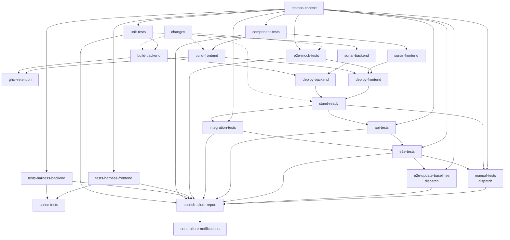

# reference-app-copy

Clean teaching fork of [reference-app](https://github.com/autotests-ai/reference-app) — **3-folder layout**, orchestrated CI/CD (block 1).

GitHub: **[github.com/autotests-ai/reference-app-copy](https://github.com/autotests-ai/reference-app-copy)** · monorepo: `projects/reference-home/reference-app-copy/`

Production: [reference-app-copy.autotests.ai](https://reference-app-copy.autotests.ai)

## Layout (3 product folders)

```
reference-app-copy/
  frontend/          # UI by language → stack
  backend/           # server by language → stack
  tests/             # automation — see tests/LAYERS.md
  deploy/            # matrix, host nginx
  .github/workflows/ # ci.yml — single workflow
```

### Naming convention

`{zone}-{language}-{stack}` — hyphens between segments.  
Underscore **only** in compound tool names, e.g. `tests-java-gradle-junit5-no_allure-selenide`.

Frontend layout: language → product module (stack in the name); component tests in `src/test/`.  
Full maps: [frontend/README.md](frontend/README.md) · [tests/NAMING.md](tests/NAMING.md) · **routing SSOT:** [deploy/matrix.yaml](deploy/matrix.yaml).

| Zone | Current modules | Future slots |
|------|-----------------|--------------|
| **frontend/javascript/** | `frontend-javascript-vanilla`, `react`, `angular`, `vue`, `jquery` (all active) | — |
| **frontend/typescript/** | `frontend-typescript-vanilla`, `react` (+ RTL), `angular`, `vue` (+ VTU), `jquery` (all active) | — |
| **frontend/_shared/** | `frontend-javascript-app`, `frontend-javascript-embed`, `frontend-react-ui` | — |
| **backend/java/** | `backend-java-spring` (active) | — |
| **backend/kotlin/** | `backend-kotlin-spring` (active) | — |
| **backend/python/** | `backend-python-flask`, `backend-python-fastapi`, `backend-python-django` (active) | — |
| **backend/go/** | `backend-go-gin`, `backend-go-stdlib` (active) | — |
| **backend/javascript/** | `backend-javascript-express`, `backend-javascript-nest` (active) | — |
| **backend/typescript/** | `backend-typescript-express`, `backend-typescript-nest` (active) | — |
| **tests/java/** | `tests-java-gradle-junit5-allure3-selenide` | junit4, testng, allure2, selenium, maven, … — [tests/NAMING.md](tests/NAMING.md) · matrix slots |
| **tests/javascript/** | `tests-javascript-playwright` | Cypress, … |
| **tests/typescript/** | — | `tests-typescript-playwright` (slot) |
| **tests/python/** | `tests-python-selenium` | playwright, … |
| **tests/kotlin/** | — | `tests-kotlin-gradle-junit5-allure3-selenide` (slot) |
| **tests/go/** | — | `tests-go-testing-allure3` (slot; selenoid-tests lang) |

### Routing (per-frontend containers × multi-backend)

```
https://reference-app-copy.autotests.ai/{backend}/{frontend}/
https://reference-app-copy.autotests.ai/{backend}/api/
```

- **first path segment** → which API answers `/{backend}/api/**`
- **second path segment** → which frontend container answers (host nginx → publish port)
- Frontends resolve `APP_BASE` / `API_BASE` from the URL — same `dist/` works under every backend prefix

Examples:

- […/backend-java-spring/frontend-typescript-react/](https://reference-app-copy.autotests.ai/backend-java-spring/frontend-typescript-react/)
- […/backend-java-spring/frontend-typescript-vue/](https://reference-app-copy.autotests.ai/backend-java-spring/frontend-typescript-vue/)
- `…/backend-python-flask/frontend-typescript-react/`
- `…/backend-python-fastapi/frontend-typescript-react/`
- `…/backend-python-django/frontend-javascript-vanilla/`

Host `/` is empty (404). One public host — no backend subdomains.

Path constants: `backend/scripts/paths.sh`

### Layers

Canon: [tests/LAYERS.md](tests/LAYERS.md) · all jobs live in [`.github/workflows/ci.yml`](.github/workflows/ci.yml)

Full CI graph (`needs` from `ci.yml`; dotted edges from `changes` are path filters / skip logic):



| Job | Where |
|-----|-------|
| `unit-tests` | `BACKEND_DIR` — command by `BACKEND_LANG` (gradle/JaCoCo, pytest, `go test`, or `npm test`) |
| `tests-harness-backend` | `TESTS_DIR` — java: `-DincludeTags=harness-backend` + JaCoCo (`ConfigReader`); every PR + push (no deploy) |
| `tests-harness-frontend` | `TESTS_DIR` — java: `-DincludeTags=harness-frontend` + JaCoCo (CSS/HAR helpers); every PR + push (no deploy) |
| `component-tests` | `FRONTEND_DIR` — `npm test -- --coverage` |
| `integration-tests` | `TESTS_DIR` — after `stand-ready` (java: `-DincludeTags=integration`); wiring of *this* deploy; ∥ `api-tests` |
| `api-tests` | `TESTS_DIR` — after `stand-ready` (java: `-DincludeTags=api`); HTTP contract; ∥ `integration-tests` |
| `e2e-mock-tests` | every PR; on `main` when frontend changed — java: `-Denv=reference_mock -DincludeTags=mock` (stub API on runner) |
| `sonar-tests` | after **both** harness jobs (PR + main); umbrella harness + tests-module Sonar gate |
| `e2e-tests` | after `integration-tests` **and** `api-tests` — java: `-DincludeTags=e2e` |
| `e2e-update-baselines` | dispatch `update_baselines=true` — java: `-DincludeTags=visual -DupdateBaselines=true` |
| `manual-tests` | after `e2e-tests` + `stand-ready`; dispatch only — java: `-DincludeTags=manual` |

`unit-tests`, `component-tests`, both harness jobs, and `e2e-mock-tests` gate a pull request.
Prod layers (`integration` / `api` / `e2e`) run on push to `main` after deploy, or via
`workflow_dispatch` booleans. Stack defaults (`BACKEND` / `BACKEND_LANG` / `FRONTEND` /
`TESTS` / `TESTS_LANG`) live once at the top of [`ci.yml`](.github/workflows/ci.yml).

## Ports (local = prod host upstream)

SSOT: [`deploy/matrix.yaml`](deploy/matrix.yaml). Language base **+10**, stack within language **+1**.

| Port | Service | Notes |
|------|---------|-------|
| **8800** | `backend-java-spring` | |
| **8810** | `backend-kotlin-spring` | |
| **8820** | `backend-python-flask` | |
| **8821** | `backend-python-fastapi` | |
| **8822** | `backend-python-django` | |
| **8830** | `backend-go-gin` | |
| **8831** | `backend-go-stdlib` | |
| **8840** | `backend-javascript-express` | |
| **8841** | `backend-javascript-nest` | |
| **8850** | `backend-typescript-express` | |
| **8851** | `backend-typescript-nest` | |
| **9800** | `frontend-javascript-vanilla` | compose publish |
| **9801** | `frontend-javascript-react` | compose publish |
| **9802** | `frontend-javascript-angular` | compose publish |
| **9803** | `frontend-javascript-vue` | compose publish |
| **9804** | `frontend-javascript-jquery` | compose publish |
| **9810** | `frontend-typescript-vanilla` | compose publish |
| **9811** | `frontend-typescript-react` | compose publish · CI deploy default |
| **9812** | `frontend-typescript-angular` | compose publish |
| **9813** | `frontend-typescript-vue` | compose publish |
| **9814** | `frontend-typescript-jquery` | compose publish |

Next backend language → **8860+**. Next frontend language → **9820+**.  
Container-internal: backends `:8080`, frontends `:80`.  
Path routing (`/{backend}/api`, `/{backend}/{frontend}`) — **host nginx** ([`deploy/nginx/`](deploy/nginx/)); local compose exposes published ports only.

## Quick start

```bash
docker compose up -d --build
# published ports (same numbers as prod host upstreams)
curl -fsS http://localhost:8800/api/health
curl -fsS http://localhost:8810/api/health
curl -fsS http://localhost:8820/api/health
curl -fsS http://localhost:8821/api/health
curl -fsS http://localhost:8822/api/health
curl -fsS -o /dev/null -w '%{http_code}\n' http://localhost:9811/
curl -fsS -o /dev/null -w '%{http_code}\n' http://localhost:9800/
# prod path shape — host nginx only
# https://reference-app-copy.autotests.ai/backend-java-spring/api/health
```

| Service | Role |
|---------|------|
| `frontend-*` (ten) | one nginx image per stack, `:9800`–`:9814` — same screens, independent source trees |
| `frontend-typescript-react` | React SPA (`:9811`) — the module CI builds and deploys |
| `backend-java-spring` | Spring JSON API (`:8800`) |
| `backend-kotlin-spring` | Spring Kotlin JSON API (`:8810`) |
| `backend-python-flask` | Flask JSON API (`:8820`) |
| `backend-python-fastapi` | FastAPI JSON API (`:8821`) |
| `backend-python-django` | Django JSON API (`:8822`) |
| `postgres` | one instance, DB per backend (`reference_app_java_spring`, `reference_app_python_flask`, …) |

## Deploy

**Production URL:** https://reference-app-copy.autotests.ai/backend-java-spring/frontend-typescript-react/

One workflow — [`.github/workflows/ci.yml`](.github/workflows/ci.yml):

| Event | Jobs |
|-------|------|
| pull request | `unit-tests` · `component-tests` · `tests-harness-backend` · `tests-harness-frontend` · `sonar-tests` |
| push to `main` | same four → BE lane through `api-tests`; FE lane through `e2e-mock-tests`; both harness → `sonar-tests`; join at `e2e-tests` → `manual-tests` |

`build` runs `docker compose build` + `docker compose push`, so `docker-compose.yml` stays the only place describing how an image is built. Images go to GHCR as `ghcr.io/autotests-ai/reference-app-copy-<service>:<sha>`; the tag comes from `IMAGE_TAG` (defaults to `latest` locally).

`deploy` connects over SSH and runs six lines: checkout the deployed commit, log in to GHCR, `docker compose pull`, `docker compose up -d`, then `curl --retry` on `/api/health`. There is no deploy script on the host. The script opens with `set -euo pipefail` — otherwise a failed `pull` would leave the previous containers running and the health check would still answer `200`.

| Setting | Value |
|---------|-------|
| `APP_DIR` | `/home/reference_app_copy/reference-app-copy` |
| Deployed stacks | `env.BACKEND` + `env.FRONTEND` in `ci.yml` (defaults: java-spring + typescript-react) |

Allure: `testops-context` + live `allurectl watch` on test jobs → `publish-allure-report` (Pages) →
`send-allure-notifications` (all non-gating). TestOps selective rerun: dispatch with
`ALLURE_JOB_RUN_ID` keeps the testplan — see [tests/LAYERS.md](tests/LAYERS.md)#testops-live-upload--selective-rerun.

### GitHub secrets & variables

| Name | Kind | Value |
|------|------|-------|
| `DEPLOY_SSH_KEY` | secret | **project-only** ed25519 for `reference_app_copy@212.92.101.15` (local: `~/.ssh/reference_app_copy_deploy`; not shared with `selenoid` / sibling apps) |
| `DEPLOY_HOST` | variable | `212.92.101.15` — required, no fallback in the workflow |
| `DEPLOY_USER` | variable | `reference_app_copy` |
| `ALLURE_TOKEN` | secret | TestOps API token (live upload; optional — without it tests still run) |
| `ALLURE_PROJECT_ID` | variable | TestOps project id |
| `ALLURE_ENDPOINT` | variable | optional; default `https://allure.autotests.cloud` |

GHCR needs no extra secret: `build` and `deploy` both authenticate with the run's `GITHUB_TOKEN` — `build` under `packages: write`, `deploy` under `packages: read`, because a freshly published package is private.

Sibling prod (do not touch): [reference-app.autotests.ai](https://reference-app.autotests.ai) · port `8083`.

### Deferred (block 2+)

- Legacy: [`tests/_deferred/`](tests/_deferred/)

## Related

- Upstream: [autotests-ai/reference-app](https://github.com/autotests-ai/reference-app)
