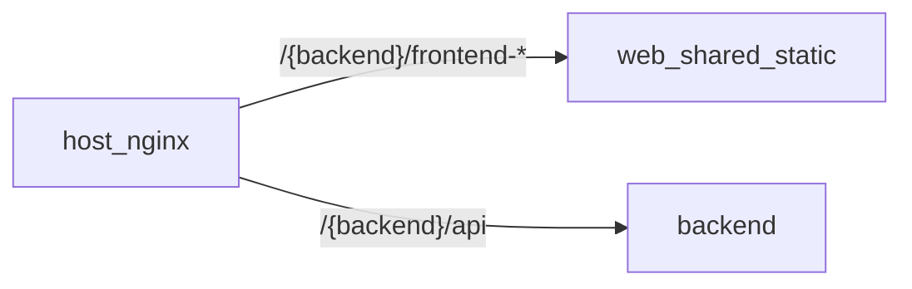

# web (shared static nginx)

One image for **all** active product UIs. No `/api` proxy.

| Path | Source |
|------|--------|
| `/frontend-typescript-react/**` | Vite `dist/` + `UI_RUNTIME` overlay |
| `/frontend-typescript-vue/**` | Vite `dist/` + `UI_RUNTIME` overlay |
| `/frontend-javascript-vanilla/**` | static module + `UI_RUNTIME` overlay |
| `/`, other | **404** |

`/api/**` and path-prefixed UI mounts are routed by **host nginx** ([`../nginx/`](../nginx/)).  
Local compose: hit published ports directly (`:8701` static, `:8800+` APIs).

Matrix SSOT: [`../matrix.yaml`](../matrix.yaml) — only `status: active` frontends are packed here.

