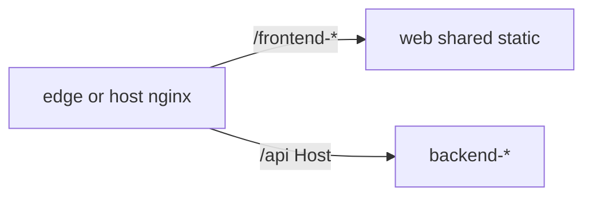

# web (shared static nginx)

One image for **all** active product UIs. No `/api` proxy.

| Path | Source |
|------|--------|
| `/frontend-typescript-react/**` | Vite `dist/` + `UI_RUNTIME` overlay |
| `/frontend-javascript-vanilla/**` | static module + `UI_RUNTIME` overlay |
| `/`, other | **404** |

`/api/**` is routed by:

- **local:** `deploy/edge` (Host → backend service)
- **prod:** host nginx vhost (`deploy/nginx/`)

Matrix SSOT: [`../matrix.yaml`](../matrix.yaml) — only `status: active` frontends are packed here.

